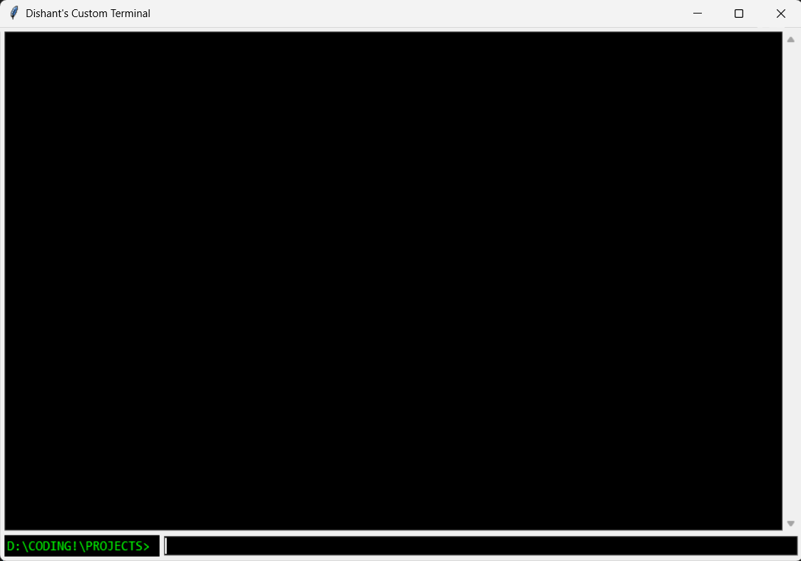

# 🖥️ Custom Terminal Emulator

A beautiful, feature-rich terminal emulator built with Python and Tkinter that provides a modern command-line experience on Windows.



## ✨ Features

- **🎨 Modern UI**: Dark theme with lime green text for that classic terminal look
- **📁 Working Directory**: Real-time display of current directory in prompt
- **📚 Command History**: Navigate through previous commands with arrow keys
- **🔍 Tab Completion**: Auto-complete file and directory names
- **⚡ Real-time Output**: Commands execute in real-time without freezing
- **🔄 Directory Navigation**: Full `cd` command support with `~` and `-` shortcuts
- **🎯 Special Commands**: Built-in `clear`, `exit`, and directory management
- **🛡️ Thread-safe**: Non-blocking command execution with proper threading

## 🚀 Quick Start

### Prerequisites

- Python 3.7 or higher
- Windows OS (tested on Windows 10/11)

### Installation

1. **Clone the repository**
   ```bash
   git clone https://github.com/Dishant-Gotis/custom-terminal.git
   cd custom-terminal
   ```

2. **Run the terminal**
   ```bash
   python COMAND.py
   ```

### Alternative: Direct Download

Download `COMAND.py` and run it directly:
```bash
python COMAND.py
```

## 📖 Usage

### Basic Commands

| Command | Description |
|---------|-------------|
| `dir` or `ls` | List directory contents |
| `cd <directory>` | Change directory |
| `cd ~` | Go to home directory |
| `cd -` | Go to previous directory |
| `clear` | Clear terminal screen |
| `exit` | Close terminal |

### Navigation

- **Arrow Keys**: Navigate command history (↑/↓)
- **Tab**: Auto-complete file/directory names
- **Enter**: Execute command

### Examples

```bash
# Navigate to a directory
cd Documents

# List files with tab completion
dir [TAB]  # Auto-completes file names

# Run system commands
ping google.com

# Check current directory
pwd

# Clear screen
clear
```

## 🛠️ Features in Detail

### Command History
- Use **Up Arrow** to cycle through previous commands
- Use **Down Arrow** to navigate forward in history
- Commands are automatically saved and deduplicated

### Tab Completion
- Press **Tab** to auto-complete file and directory names
- Shows multiple options if there are multiple matches
- Automatically adds `/` for directories

### Directory Management
- Full `cd` command support
- `~` expands to home directory
- `-` returns to previous directory
- Relative and absolute path support

### Real-time Execution
- Commands run in separate threads
- Output appears as commands execute
- No UI freezing during long operations

## 🎨 Customization

### Colors and Theme
The terminal uses a classic green-on-black theme. To customize:

```python
# In COMAND.py, modify these lines:
self.output_text = ScrolledText(
    main_frame, 
    wrap=tk.WORD, 
    font=("Consolas", 11), 
    bg="black",        # Background color
    fg="lime",         # Text color
    insertbackground="lime"
)
```

### Font and Size
Change the font family and size:
```python
font=("Consolas", 11)  # Font family, size
```

## 📁 Project Structure

```
custom-terminal/
├── COMAND.py          # Main terminal application
├── README.md          # This file
├── LICENSE            # MIT License
├── requirements.txt   # Python dependencies
├── .gitignore         # Git ignore file
├── screenshots/       # Screenshots and images
│   └── terminal.png   # Terminal screenshot
└── docs/             # Additional documentation
    └── CONTRIBUTING.md
```

## 🤝 Contributing

We welcome contributions! Please see our [Contributing Guide](docs/CONTRIBUTING.md) for details.

### How to Contribute

1. Fork the repository
2. Create a feature branch (`git checkout -b feature/amazing-feature`)
3. Commit your changes (`git commit -m 'Add amazing feature'`)
4. Push to the branch (`git push origin feature/amazing-feature`)
5. Open a Pull Request

## 🐛 Bug Reports

If you find a bug, please open an issue with:
- A clear description of the problem
- Steps to reproduce the issue
- Expected vs actual behavior
- Your operating system and Python version

## 📝 License

This project is licensed under the MIT License - see the [LICENSE](LICENSE) file for details.

## 🙏 Acknowledgments

- Built with [Tkinter](https://docs.python.org/3/library/tkinter.html)
- Inspired by classic terminal emulators
- Thanks to the Python community for excellent documentation

## 📊 Project Stats


---

**Made with ❤️ by [Your Name]**

If you find this project helpful, please give it a ⭐! 
